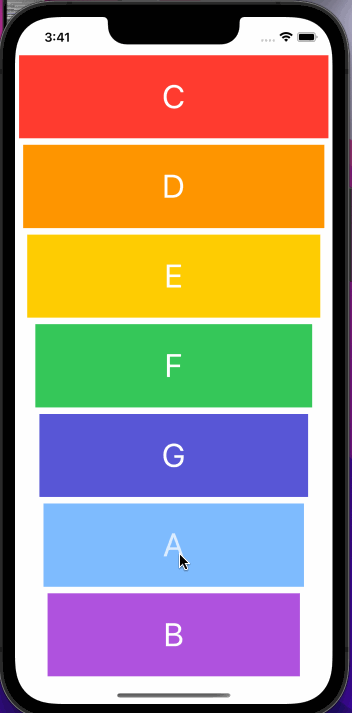

# Xylophone

## My Goal

Create Xylophon musical app.

## What I will create

I will be making my first musical instrument! Music apps are so popular on the App Store that they even get their own category.

## What I will learn

* How to play sound using AVFoundation and AVAudioPlayer.
* Understand Apple documentation and how to use StackOverflow.
* Functions and methods in Swift. 
* Data types.
* Swift loops.
* Variable scope.
* The ViewController lifecycle.
* Error handling in Swift.
* Code refactoring.
* Basic debugging.

